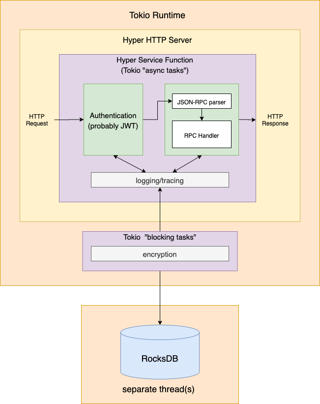

# BAF Wallet

Whitelabel optionally-custodial hosted wallet for the NEAR blockchain as described by [this article](https://medium.com/nearprotocol/on-usability-of-blockchain-applications-398963798ab3)

## Goals

1. Minimalism - this thing should three things and only those three things - authenticate users, sign transactions, and store keys. There will likely only be that many endpoints, and as a result we don't need a full-blown web framework. We also are only storing keys and authentication-related information (email / hashed and salted password, etc), so we are going to use a key-value database.
2. Simplicity - should require the minimum amount of infrastructure to manage.
3. Learning - as a project, this should be structured in a manner that's especially geared towards individuals who lack experience with rust or building production-ready codebases

## Overview

At a high level, the BAF Wallet is a REST API with an `/rpc/` endpoint that exposes a [JSON-RPC 2.0](https://www.jsonrpc.org/specification) interface. It's built using [hyper](https://hyper.rs/guides/server/hello-world/) that uses [rocksdb](https://github.com/rust-rocksdb/rust-rocksdb) as a persistent embedded data store. This removes a lot of the complexity we'd otherwise have if we were to use an external database and it makes the attack surface a lot smaller. For a more detailed description of the API, see [API.md](./API.md).

At a high level, when a JSON-RPC 2.0 request from some user `U` to sign some transaction `T` comes in, the following happens:

1. Hyper receives and parses the HTTP request
2. Some middleware will check authentication headers and deny access if they are invalid.
3. A new handler function is instantiated by hyper to handle that request
4. Inside the handler function instance:
   1. The JSOHN-RPC params are parsed
   2. The relavant RPC is executed by the handler, including any involved  database access, encryption, and/or audit tracing/logging
   3. The result is serialized and returned as an HTTP response from the handler
5. Once the handler returns, Hyper does the rest

## Project Organization

When using `tokio`, [asynchronous tasks are not supposed to block](https://docs.rs/tokio/1.1.1/tokio/task/index.html), so we need to make sure to do all blocking code happens within a closure supplied to [`spawn_blocking`](https://docs.rs/tokio/1.1.1/tokio/task/index.html#spawn_blocking). Everything else can go in an `asynchronous` task. More specifically:

blocking tasks:
* cryptographic key generation
* digital signatures
* any call to or code running as a part of `rocksdb`, which uses blocking I/O
* verfying JWT's 

asynchronous tasks:
* network stuff (sending/receiving requests, etc)
* (de)serialization
* other simple tasks that aren't CPU-bound and don't use blocking I/O

Since rocksdb uses blocking I/O and manages its own threadpool, it should be kept separate from the tokio threadpool. This lends intself to an architecture that looks something like this:

## Notes

* `sodiumoxide` depends on `libsodium`, which is written in C, so you may run into compilation trouble. If you do, I reccomend installing `pkg-config` and `libsodium` separately using using your prefered package manager (e.g. `apt install pkg-config libsodium` on WSL/Ubuntu, `brew install pkg-config libsodium` on MacOSr). Then set the env variable `SODIUM_USE_PKG_CONFIG=1` as documented [here]([your prefered package manage](https://github.com/sodiumoxide/sodiumoxide#extended-usage)) to make `sodiumoxide` use the libsodium installed in the previous step.
 do `source use_pkg_config.sh` to set this env variable automatically.
